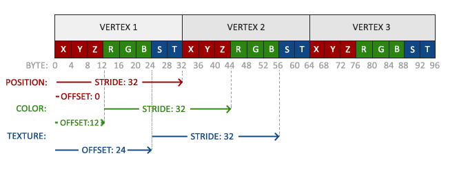

 # VAOs, VBOs, Vertex and Fragment Shaders 

 ## Reference
 - [Tutorial2: VAOs, VBOs, Vertex and Fragment Shaders (C / SDL)](https://www.khronos.org/opengl/wiki/Tutorial2:_VAOs,_VBOs,_Vertex_and_Fragment_Shaders_(C_/_SDL))
可以把VBO理解成一个数据区域，这里面存放了渲染所需要的一切信息。但数据在VBO里面的时候，OpenGL是并不知道这里面的每个数据所代表的具体含义的，只是一堆数值罢了。
这时候，VAO(vertex array object)就派上用场了。VAO指定了读取VBO的方式
VAO可以定义一种格式说，我每次只取VBO里面的x,y,z的值；也可以定义一种格式说，每次只取VBO里面的r,g,b的值。
这样我们就可以在渲染的时候，绑定不同的VAO，实现按照不同的格式将VBO里面的东西渲染出来

通过定义VBO里面数据存放的方式, VAO的格式以及合适的GLSL 语言，就能够灵活地画出我们所需要的各种图形。


## A Vertex Array Object (VAO) 
VAO is an object which contains one or more Vertex Buffer Objects and is designed to store the information for a complete rendered object. For example, a diamond consisting of four vertices as well as a color for each vertex.

##  A Vertex Buffer Object (VBO) 
VBO is a memory buffer in the high speed memory of your video card designed to **hold information about vertices**. 
In our example we have two VBOs, one that describes the coordinates of our vertices and another that describes the color associated with each vertex. VBOs can also store information such as normals, texcoords, indicies, etc.



## Shader 
- Vertext shader in OpenGL is a piece of C like code written to the GLSL specification which influences the attributes of a vertex. Vertex shaders can be used to modify properties of the vertex such as position, color, and texture coordinates.

- Fragment Shader is similar to a Vertex Shader, but is used for calculating individual fragment colors. This is where lighting and bump-mapping effects are performed.

- Geometry Shaders are used to create additional vertices.

The shader pipeline behaves as follows: Vertex Shaders -> Geometry Shaders -> (Rasterizing Engine) -> Fragment Shaders.

The shaders are compilied and then chained together into a Shader Program.

The shaders receive input data from our VAO through a process of attribute binding, allowing us to perform the needed computations to provide us with the desired results.

##  glBindVertexArrays VS glBindBuffer
VBO为顶点缓冲区对象，用于存储顶点坐标/顶点uv/顶点法线/顶点颜色，也可以用于其他用途，比如tangent。
IBO为索引缓冲区，里面的值可以是unsigned int或者unsigned short。
一个VAO有多个VBO，它们之间也是通过上下文，只有唯一的激活VAO，在VAO后创建的VBO都属于该VAO。
关联VBO数据用取得当前激活的缓存区对象偏移来指定。

VAO是一个对象，其中包含一个或者更多的Vertex Buffer Objects。
而VBO是Graphics Card中的一个内存缓冲区，用来保存顶点信息，颜色信息，法线信息，纹理坐标信息和索引信息等等。
VAO在Graphics Card线性的存储几个对象信息，替代了以前发送我们需要的数据到Graphics Card上，这也是Direct3D没有立即模式情况下工作的方法，这就意味着应用程序不需要传输数据到Graphics Card上而得到较高的性能。

```
GLuint abuffer;
// Generate a name for a new buffer. e.g. buffer = 2
glGenVertexArrays(1, &abuffer);
// Make the new array active, creating it if necessary.
glBindVertexArray(abuffer);

GLuint buffer;
glGenBuffers(1, &buffer);
// Make the buffer the active array buffer.
glBindBuffer(GL_ARRAY_BUFFER, buffer);
glBufferData(GL_ARRAY_BUFFER, sizeof(points), points, GL_STATIC_DRAW);
```

