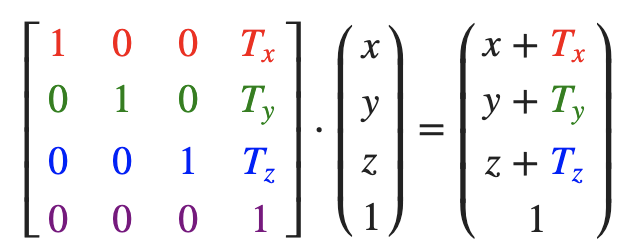
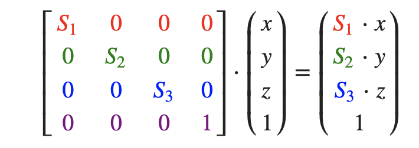

# Transform
https://learnopengl-cn.github.io/01%20Getting%20started/07%20Transformations/


2D/3D变换都可以放在一个矩阵中，用这个矩阵乘以向量将变换(Transform)这个向量。


## 位移(Translation)


把一个向量(1, 0, 0)位移(1, 1, 0)个单位
```
  glm::vec4 vec(1.0f, 0.0f, 0.0f, 1.0f);

  // 0.9.9及以上版本下面这行代码就需要改为:
  // glm::mat4 trans = glm::mat4(1.0f)
  
  glm::mat4 trans; 
  
  trans = glm::translate(trans, glm::vec3(1.0f, 1.0f, 0.0f));  // trasn for moving (1,1,0)
  vec = trans * vec;
  std::cout << vec.x << vec.y << vec.z << std::endl;
```


## 缩放(Scaling)


缩放0.5倍
```
glm::mat4 trans = glm::mat4(1.0f);

trans = glm::scale(trans, glm::vec3(0.5, 0.5, 0.5));
```
## 旋转(Rotation)


在3D空间中旋转需要定义一个角和一个旋转轴(Rotation Axis)。


将多个矩阵复合，比如先沿着x轴旋转再沿着y轴旋转。但是这会导致万向节死锁 (Gimbal Lock)


3D空间中的旋转，一个更好的模型是沿着任意的一个轴，比如单位向量$(0.662, 0.2, 0.7222)$旋转，而不是对一系列旋转矩阵进行复合

避免万向节死锁的真正解决方案是使用四元数(Quaternion)，它不仅更安全，而且计算会更有效率。


逆时针旋转90度
```
glm::mat4 trans = glm::mat4(1.0f);

// vec3(x, y, z) is axis of rotation (e.g. 0 1 0)
trans = glm::rotate(trans, glm::radians(90.0f), glm::vec3(0.0, 0.0, 1.0));
```

## 矩阵的组合
使用矩阵进行变换的真正力量在于，根据矩阵之间的乘法，我们可以把多个变换组合到一个矩阵中。

```
  glm::mat4 trans;
  trans = glm::rotate(trans, glm::radians(90.0f), glm::vec3(0.0, 0.0, 1.0));

  trans = glm::scale(trans, glm::vec3(0.5, 0.5, 0.5));
```

