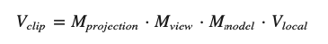

## 局部空间(Local Space / Object Space)
顶点是被设定在-0.5到0.5的坐标范围中，(0, 0)是它的原点

## 世界空间(World Space)
物体的坐标将会从局部变换到世界空间；该变换是由 Model Matrix实现

Model Matrix 是一种变换矩阵，它能通过对物体进行位移、缩放、旋转来将它置于它本应该在的位置或朝向。

## 观察空间(View Space / Eye Space / Camera Space)
观察空间是将世界空间坐标转化为用户视野前方的坐标而产生的结果
常是由一系列的位移和旋转的组合来完成，平移/旋转场景从而使得特定的对象被变换到摄像机的前方。
这些组合在一起的变换通常存储在 View Matrix

## 裁剪空间(Clip Space)
Projection Matrix 指定了一个范围的坐标，比如在每个维度上的-1000到1000。
投影矩阵接着会将在这个指定的范围内的坐标变换为标准化设备坐标的范围(-1.0, 1.0)。

由投影矩阵创建的观察箱(Viewing Box)被称为平截头体(Frustum)

```
glm::mat4 proj = glm::perspective(glm::radians(45.0f), (float)width/(float)height, 0.1f, 100.0f);
```
第一个参数定义了fov的值，它表示的是视野(Field of View)，并且设置了观察空间的大小。
通常设置为45.0f，但想要一个末日风格的结果你可以将其设置一个更大的值。

第二个参数设置了宽高比，由视口的宽除以高所得。

第三和第四个参数设置了平截头体的近和远平面。通常设置近距离为0.1f，而远距离设为100.0f。所有在近平面和远平面内且处于平截头体内的顶点都会被渲染。


