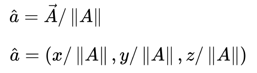
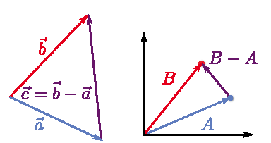
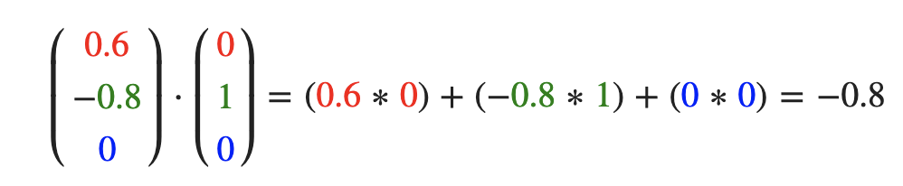
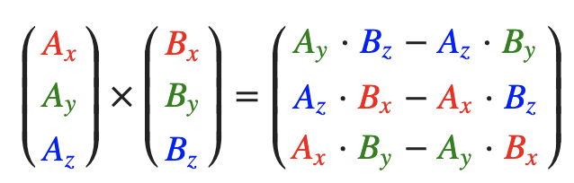
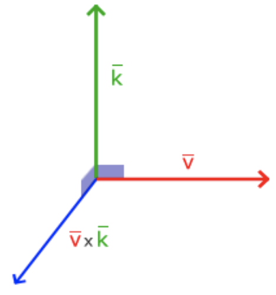

## Vector vs Scalar
A vector is a quantity that has a `magnitude` and a `direction`. 
For example: displacement, velocity, acceleration and force.

In a 3D coordinate system, a vector is specified by the coordinates with respect to the coordinate system.

Vector magnitude = sqr(x^2 + y^2 + z^2)

Unit Vector / Normalized vectors
In some cases, we don't care about the magnitude of the vector, we just want to know the
direction of the vector.

In unit vectors, the X, Y, and Z components of the vector are divided by the magnitude to
create a vector of unit length.




Forward vector  is the vector that represents the “straight ahead” direction for the object.

### Getting a Vector between Two Points: Subtraction

```
  Vector2 target, ship;
  Vector2 result = target - ship;
```

### Scaling a Vector: Scalar Multiplication
Multiplying a vector by a positive scalar only changes the magnitude of the vector, 
while multiplying by a negative scalar also inverts the direction of the vector

### Combining Two Vectors: Addition
suppose the player is at point p, and the player’s forward vector is f . 
The point that is 150 units “in front” of the player is then p + 150 *f 


### Determining a Distance: Length
length squared (the square of the length) of each vector


### Determining Directions: Unit Vectors and Normalization 
A `unit vector` is a vector with a length of one.
To normalize a vector, divide each component by the length of the vector:
```
  Vector2 a;
  a.Normalize(); // a is now normalized

  Vector2 a;
  Vector2 result = Vector2::Normalize(a);
```

### Converting from an Angle to a Forward Vector

Actor class has a rotation represented by an angle in radians.
This allows you to rotate the way an actor faces. 

In 2D for now, the angle directly corresponds to an angle on the unit circle,
x = cos()
unit circle has +y as up, whereas SDL 2D graphics use +y down
```
  Vector3 Actor::GetForward() const
  {
    return Vector2(Math::Cos(mRotation), - Math::Sin(mRotation));
  }
```


## Converting a Forward Vector to an Angle:
Want a ship to face toward an asteroid. 
1. construct the vector from the ship to the asteroid and normalize this vector.
2. use atan2 to convert the new forward vector to an angle. 
3. set the ship actor’s rotation to this new angle. 
Note that you must negate the y component to account for +y down in SDL’s 2D coordinate system
```
  // (ship and asteroid are Actors)
  Vector2 shipToAsteroid = asteroid->GetPosition() - ship->GetPosition();
  shipToAsteroid.Normalize();

  // Convert new forward to angle with atan2 (negate y-component for SDL)
  float angle = Math::Atan2(-shipToAsteroid.y, shipToAsteroid.x);
  
  ship->SetRotation(angle);
```
## Determining the Angle Between Two Vectors: Dot Product
dot productis 0 means that they are perpendicular to each other because cos(π / 2)= 0 . 

dot product of 1 means the two vectors are parallel and face the same direction. 

dot product of −1 means they are antiparallel
```
  float dotResult = Vector2::Dot(origForward, newForward);
  float angle = Math::Acos(dotResult);
```

### Calculating a Normal: Cross Product
```
  A x B = - B x A
```
The cross product does not work with 2D vectors. However, to convert a 2D vector into a 3D vector, just add a z component of 0.

Using the left-hand rule is a quick way to figure out the direction the cross product result faces

## 向量与标量运算
## Dot Product
点乘是通过将对应分量逐个相乘，然后再把所得积相加来计算

两个向量的点乘 = 它们的数乘结果乘以两个向量之间夹角的余弦值

两个单位向量的点乘 = 它们的数乘结果乘以两个向量之间夹角的余弦值

90度的余弦值是0，0度的余弦值是1
使用点乘可以很容易测试两个向量是否正交(Orthogonal)或平行

两个向量的夹角。点乘会在计算光照的时候非常有用。




### Cross Product

叉乘只在3D空间中有定义，它需要两个不平行向量作为输入，生成一个正交于两个输入向量的第三个向量




