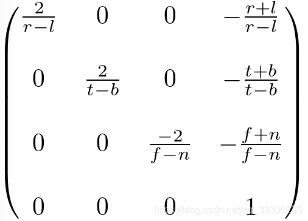
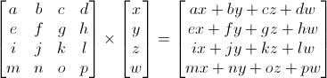

## Math

### Vector vs Scalar
向量(Vector)在 坐标系中同时具备 方向(Direction)和大小(Magnitude，也叫做强度或长度), 比如 速度 就是向量, 距离是标量。 向量是没有位置的, 只有方向和长度大小

标量(Scalar)只是一个数字 或者说是仅有一个分量的向量

有一个特殊类型的向量叫做单位向量(Unit Vector)。单位向量有一个特别的性质——它的长度是1。

可以用任意向量的每个分量除以向量的长度得到它的单位向量n̂

我们把这种方法叫做一个向量的标准化(Normalizing)。通常单位向量会变得很有用，特别是在我们只关心方向不关心长度的时候（如果改变向量的长度，它的方向并不会改变）。

### Dot Product
两个向量的点乘 = 它们的数乘结果乘以两个向量之间夹角的余弦值


### Cross Product

### identity matrix E
A x E = A


## 放缩

## Move


## 旋转


## Projection / Orthogonal Matrix
- [Projection Matrices in OpenGL](https://www.youtube.com/watch?v=xZs6K7VLM7A&ab_channel=TheCherno)
- [OpenGL中投影矩阵(Projection Matrix)详解]




## translate


## rotate


## Normalized Device Coodination(NDC)
the x, y and z values vary from -1.0 to 1.0


## Normal (法线/法向量)
In geometry, a normal is an object such as a line, ray, or vector that is `perpendicular` to a given object.


## 齐次坐标（Homogeneous coordinates）
齐次坐标使得我们可以用同一个公式对点和方向作运算。

若w==1，则向量(x, y, z, 1)为空间中的点。
若w==0，则向量(x, y, z, 0)为方向。


##变换矩阵（Transformation matrices）
矩阵 x 顶点（记住顺序！！矩阵左乘顶点，顶点用列向量表示）= 变换后的顶点



用C++，GLM表示：
```
glm::mat4 myMatrix;
glm::vec4 myVector;
// fill myMatrix and myVector somehow
glm::vec4 transformedVector = myMatrix * myVector; // Again, in this order ! this is important.
```

用GLSL表示：
```
mat4 myMatrix;
vec4 myVector;
// fill myMatrix and myVector somehow
vec4 transformedVector = myMatrix * myVector; // Yeah, it's pretty much the same than GLM
```
## 平移矩阵（Translation matrices）


用C++，GLM表示：
```
#include <glm/gtx/transform.hpp> // after <glm/glm.hpp>

glm::mat4 myMatrix = glm::translate(glm::mat4(), glm::vec3(10.0f, 0.0f, 0.0f));
glm::vec4 myVector(10.0f, 10.0f, 10.0f, 0.0f);
glm::vec4 transformedVector = myMatrix * myVector; // guess the result
```
用GLSL表示
实际中我们几乎不用GLSL计算变换矩阵。大多数情况下在C++代码中用glm::translate()算出矩阵，然后把它传给GLSL。在GLSL中只做一次乘法：
```
vec4 transformedVector = myMatrix * myVector;
```

## 单位矩阵（Identity matrix）
单位矩阵很特殊，它什么也不做。单位矩阵的身份和自然数”1”一样基础而重要，
C++
```
  glm::mat4 myIdentityMatrix = glm::mat4(1.0);
```
单位矩阵只是缩放矩阵的一个特例，其(X, Y, Z) = (1, 1, 1)。单位矩阵同时也是旋转矩阵的一个特例，其(X, Y, Z)=(0, 0, 0)）。


## 缩放矩阵（Scaling matrices）


## 旋转矩阵（Rotation matrices）
```
#include <glm/gtc/matrix_transform.hpp> and #include <glm/gtx/transform.hpp>

glm::vec3 myRotationAxis( ??, ??, ??);
glm::rotate( angle_in_degrees, myRotationAxis );
```


## 累积变换
TransformedVector = TranslationMatrix * RotationMatrix * ScaleMatrix * OriginalVector;
！！！注意！！！这行代码首先执行缩放，接着旋转，最后才是平移。这就是矩阵乘法的工作方式。

假设有个船的模型（为简化，略去旋转）：

错误做法：

- 按(10, 0, 0)平移船体。船体中心目前距离原点10个单位。
- 将船体放大2倍。以原点为参照，每个坐标都变成原来的2倍，就出问题了。最后您得到的是一艘放大的船，但其中心位于2*10=20。这并非您预期的结果。

正确做法：
- 将船体放大2倍，得到一艘中心位于原点的大船。
- 平移船体。船大小不变，移动距离也正确。


用C++，GLM表示：
```
glm::mat4 myModelMatrix = myTranslationMatrix * myRotationMatrix * myScaleMatrix;
glm::vec4 myTransformedVector = myModelMatrix * myOriginalVector;
```
用GLSL表示：
```
mat4 transform = mat2 * mat1;
vec4 out_vec = transform * in_vec;
```

## 投影矩阵（projectionMatrix）
```
// Generates a really hard-to-read matrix, but a normal, standard 4x4 matrix nonetheless
glm::mat4 projectionMatrix = glm::perspective(
    glm::radians(FoV), // The vertical Field of View, in radians: the amount of "zoom". Think "camera lens". Usually between 90&deg; (extra wide) and 30&deg; (quite zoomed in)
    4.0f / 3.0f,       // Aspect Ratio. Depends on the size of your window. Notice that 4/3 == 800/600 == 1280/960, sounds familiar ?
    0.1f,              // Near clipping plane. Keep as big as possible, or you'll get precision issues.
    100.0f             // Far clipping plane. Keep as little as possible.
);
```